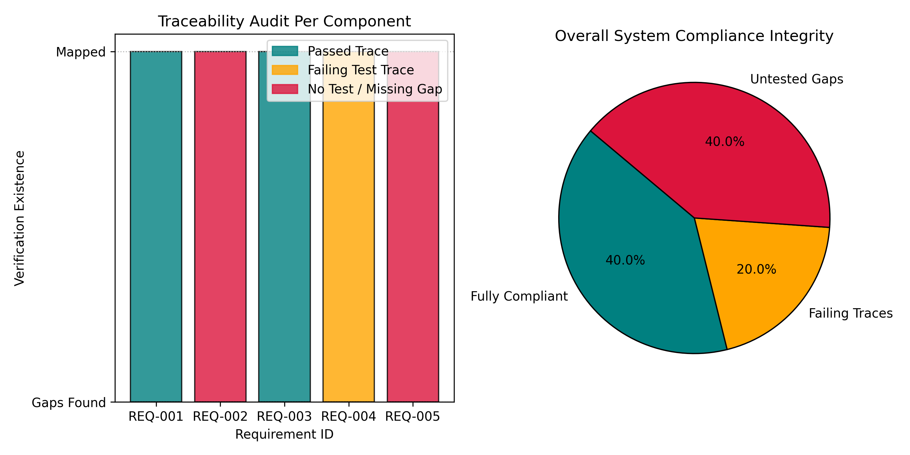

# Automated Requirements Traceability & Verification Validation Engine

## 📌 Project Overview
This repository contains a production-ready engineering compliance and systems engineering audit tool implemented in Python. In high-reliability industrial domains (such as aerospace, defense, automotive, and medical devices), complex systems cannot be deployed without proving that every high-level system requirement is actively mapped to a corresponding hardware block and verified via physical testing. This project acts as a lightweight **Model-Based Systems Engineering (MBSE) validation engine**—utilizing regular expressions (Regex) and relational data structures to automatically parse unstructured engineering documentation, build a functional traceability graph, and flag structural compliance vulnerabilities.

## ⚡ Technical Architecture
The engine compiles, cross-references, and audits system integrity across three distinct computational layers:
* **Engineering Data Ingestion:** Parses distinct configuration data tables representing system-level operational requirements (e.g., input voltage tolerances, antenna counts) and hardware validation engineering test logs.
* **Regex-Driven Dependency Mapping:** Deploys regular expression string extraction pattern-matching matrices to scan free-text verification descriptions, extracting target structural reference handles (`REQ-XXX`) to establish relational link associations.
* **Deterministic Verification Audit:** Performs a relational left join across data spaces to generate an automated structural compliance ledger. It categorizes the architectural status of each system component into one of three distinct compliance tracks:
  1. *Fully Compliant:* A test plan is mapped, and the hardware testing status reads `PASSED`.
  2. *Failing Trace:* A test plan is mapped, but the hardware fails to satisfy compliance thresholds (`FAILED`).
  3. *Untested Gap (Red-Flag):* High-level requirements exist, but no hardware validation mapping can be programmatically detected.

## 📊 Compliance Audit & Metrics Profile
The architectural health of a mock high-reliability hardware configuration was audited by the verification pipeline:



* **Component Level Audit:** The bar graph tracks individual components, immediately isolating unverified dependencies (`REQ-002` Overcurrent Protection and `REQ-005` Emergency Cutoff) from failing operational modules (`REQ-004` Thermal Dissipation).
* **System-Wide Compliance State:** The system diagnostic reports that only **40.0%** of the project design is fully compliant, warning engineering managers of a **40.0% coverage gap** in unmapped requirements and a **20.0% integration test failure rate**.

## 🛠️ How to Replicate
1. Launch the file `notebooks/requirements_traceability_engine.ipynb` inside [Google Colab](https://colab.research.google.com/).
2. Execute the processing cells sequentially to build the data baselines, run the regex parser, and compute the structural mappings.
3. The script outputs a text-based compliance ledger to the console and saves the high-resolution tracking graphics to your environment.

## 📂 Repository Structure
```text
├── notebooks/          # Interactive Colab notebooks containing compliance algorithms
├── assets/             # Exported system compliance pie charts and audit plots
└── README.md           # Professional project documentation
